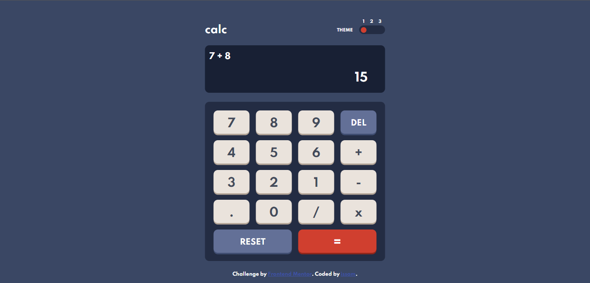
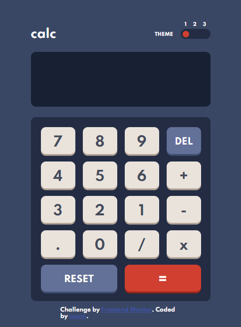
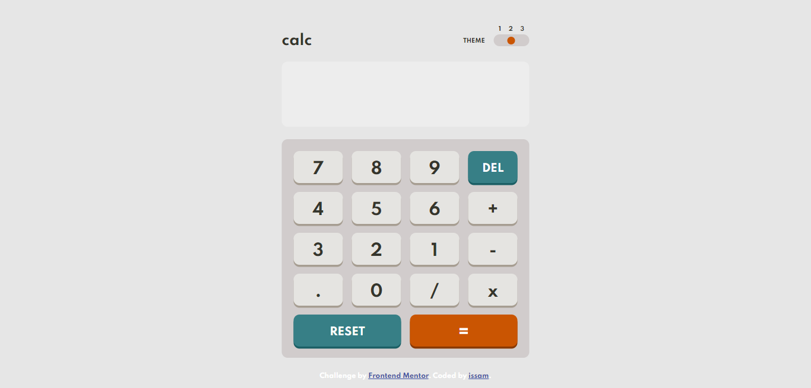
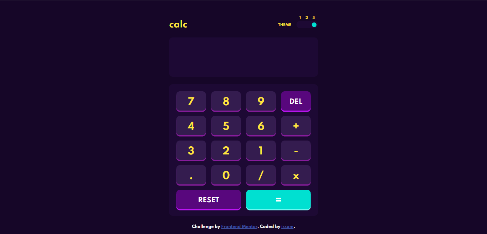

# Frontend Mentor - Calculator app solution

This is a solution to the [Calculator app challenge on Frontend Mentor](https://www.frontendmentor.io/challenges/calculator-app-9lteq5N29). Frontend Mentor challenges help you improve your coding skills by building realistic projects.

## Table of contents

-   [Overview](#overview)
    -   [The challenge](#the-challenge)
    -   [Screenshot](#screenshot)
    -   [Links](#links)
    -   [Built with](#built-with)
    -   [What I learned](#what-i-learned)
-   [Author](#author)

## Overview

### The challenge

Users should be able to:

-   See the size of the elements adjust based on their device's screen size
-   Perform mathmatical operations like addition, subtraction, multiplication, and division
-   Adjust the color theme based on their preference
-   **Bonus**: Have their initial theme preference checked using `prefers-color-scheme` and have any additional changes saved in the browser

### Screenshot

### Links

-   Solution URL: [Add solution URL here](https://your-solution-url.com)
-   Live Site URL: [Add live site URL here](https://your-live-site-url.com)

### Built with

-   HTML5
-   CSS3
-   Flexbox
-   CSS Grid
-   Responsive Layout
-   javascript (vanilla)

### What I learned

well bunch of stuff as always, changing themes and calculations ... so yeah a lot of things

### Continued development

I'll learn react in the next months make some awesome things that will take my skills to the up-level inchallah

## Author

-   Frontend Mentor - [@yourusername](https://www.frontendmentor.io/profile/yourusername)
-   Instagram - [@yourusername]()
